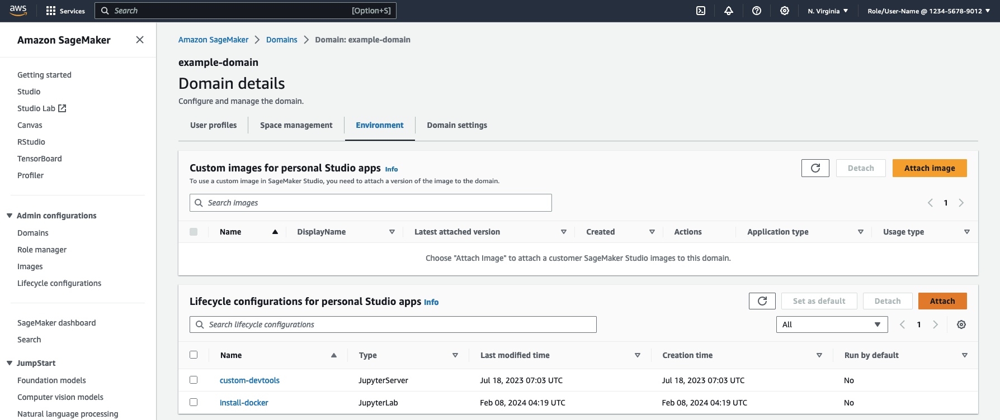

# SageMaker Studio Lifecycle Configuration Samples

## Overview

A collection of samples customizing [Amazon SageMaker Studio](https://aws.amazon.com/sagemaker/studio/) using Lifecycle Configuration scripts.

Lifecycle Configurations provide a mechanism to customize SageMaker Studio environments via shell scripts that are executed during the environment's lifecycle: Including new-style [Code Editor](https://aws.amazon.com/blogs/machine-learning/new-code-editor-based-on-code-oss-vs-code-open-source-now-available-in-amazon-sagemaker-studio/) and [JupyterLab Spaces](https://aws.amazon.com/blogs/machine-learning/boost-productivity-on-amazon-sagemaker-studio-introducing-jupyterlab-spaces-and-generative-ai-tools/) as well as JupyterServer and KernelGateway apps in [SageMaker Studio Classic](https://docs.aws.amazon.com/sagemaker/latest/dg/studio.html).

## Getting started with SageMaker Studio LCCs

You can create Studio LCCs through the [Admin configurations > Lifecycle configurations](https://console.aws.amazon.com/sagemaker/home?#/lifecycle-configurations?tab=JupyterLab) sidebar tab in the AWS Console for Amazon SageMaker; as well as via the [`aws sagemaker create-studio-lifecycle-config` CLI](https://docs.aws.amazon.com/cli/latest/reference/sagemaker/delete-studio-lifecycle-config.html) and [corresponding API](https://docs.aws.amazon.com/sagemaker/latest/APIReference/API_CreateStudioLifecycleConfig.html).

> ⚠️ **Warning:** If you're using a Windows computer, be aware LCC scripts must use Unix-style `LF` [line endings](https://stackoverflow.com/questions/1552749/difference-between-cr-lf-lf-and-cr-line-break-types) rather than Windows-style `CRLF`. You might find issues if uploading scripts through the AWS Console today, so we'd suggest using the CLI/APIs instead.

Once you've created your LCC, you'll need to **attach** it to your Studio Domain which can be done through the [Admin configurations > Domains](https://console.aws.amazon.com/sagemaker/home?#/studio?tab=environment) tab in the AWS Console. Select your domain and click through to the "Environment" tab as shown below:

For **Studio Classic JupyterServer LCCs**, you'll need to make sure your LCC is enabled to "Run by default" for it to affect users (since there's no user selection option when launching Studio). For new-style Studio JupyterLab and Code Editor LCCs, you can choose whether to choose one of your LCCs by default or not.

If you prefer, you can also configure LCC visibility and applicability at the **user profile level** instead of the whole domain. 
In the AWS Console, you can click through to your target user profile and click *Edit* to configure these settings.

The equivalent APIs for these console operations are [UpdateDomain](https://docs.aws.amazon.com/sagemaker/latest/APIReference/API_UpdateDomain.html) and [UpdateUserProfile](https://docs.aws.amazon.com/sagemaker/latest/APIReference/API_UpdateUserProfile.html).

When a Studio app/space is started with a LCC enabled, an Amazon CloudWatch Log stream should be created within the [/aws/sagemaker/studio log group](https://console.aws.amazon.com/cloudwatch/home?#logsV2:log-groups/log-group/$252Faws$252Fsagemaker$252Fstudio), with a name like `$DOMAIN_ID/$USER_PROFILE_NAME/$APP_TYPE/LifecycleConfigOnStart` (where e.g. `$APP_TYPE` could be `JupyterLab` for new-style Studio JupyterLab spaces, `JupyterServer` for Studio Classic, or `CodeEditor` for new-style Studio Code Editor spaces). You can use these log streams to debug any problems while customizing your LCCs.

## Sample scripts

### Studio spaces and hybrid scripts

The following samples should work in "new-style" SageMaker Studio spaces (such as JupyterLab and Code Editor) launched at re:Invent 2023 - or in both new and SageMaker Studio Classic.

| JupyterLab Spaces | Code-Editor Spaces | Studio Classic | Name / Link | Use-Case Description |
|:-----------------:|:------------------:|:--------------:|:-----------:|:---------------------|
| ✅ | ✅ | ❌ | [install-docker-local-mode](scripts/install-docker-local-mode/README.md) | Install Docker CLI tools to enable using [SageMaker Local Mode](https://aws.amazon.com/blogs/machine-learning/use-the-amazon-sagemaker-local-mode-to-train-on-your-notebook-instance/) for faster debugging in Studio notebook environments. |

### Studio Classic scripts

The following samples are currently **only** applicable to SageMaker Studio Classic environments.

* [git-clone-repo](scripts/git-clone-repo) - Checks out a Git repository under the user's home folder automatedly when the Jupter server starts
* [install-autoshutdown-server-extension](scripts/install-autoshutdown-server-extension) (Recommended) - Installs only the server part of idle-kernel shutdown extension. No external dependencies to install, recommended to use in VPCOnly mode with restricted Internet connectivity. Idle timelimit has to be set using Life Cycle Configuration script.
* [install-autoshutdown-extension](scripts/install-autoshutdown-extension) - Installs the auto idle-kernel shutdown extension on the Jupyter Server. This install allows users to set idle timeout limit using the UI. ***Note***: *The UI plugin is only compatible with JupyterLab v1.0. See [JupyterLab versioning](https://docs.aws.amazon.com/sagemaker/latest/dg/studio-jl.html) for JupyterLab versions in SageMaker Studio.*
* [install-lsp-features](scripts/install-lsp-features) - Installs coding assistance tools to enable features like auto-completion, linting, and hover suggestions in Studio JupyterLab v3+.
* [disable-automatic-kernel-start](disable-automatic-kernel-start) - Disables automatic starting of kernel when opening notebooks. Only works with Studio JupyterLab v3.3+.
* [install-pip-package-on-kernel](scripts/install-pip-package-on-kernel) - Installs a python package with pip on a Studio Kernel
* [set-git-config](scripts/set-git-config) - This script sets the username and email address in Git config.
* [set-git-credentials](scripts/set-git-credentials) - Adds the user's git credentials to Secret Manager and configures git to fetch the credentials from there when needed
* [set-proxy-settings](scripts/set-proxy-settings) - Configures HTTP and HTTPS proxy settings on jupter server and on the Studio kernels.

### Developing LCC Scripts for SageMaker Studio

For best practicies, please check the [DEVELOPMENT.md](DEVELOPMENT.md).
